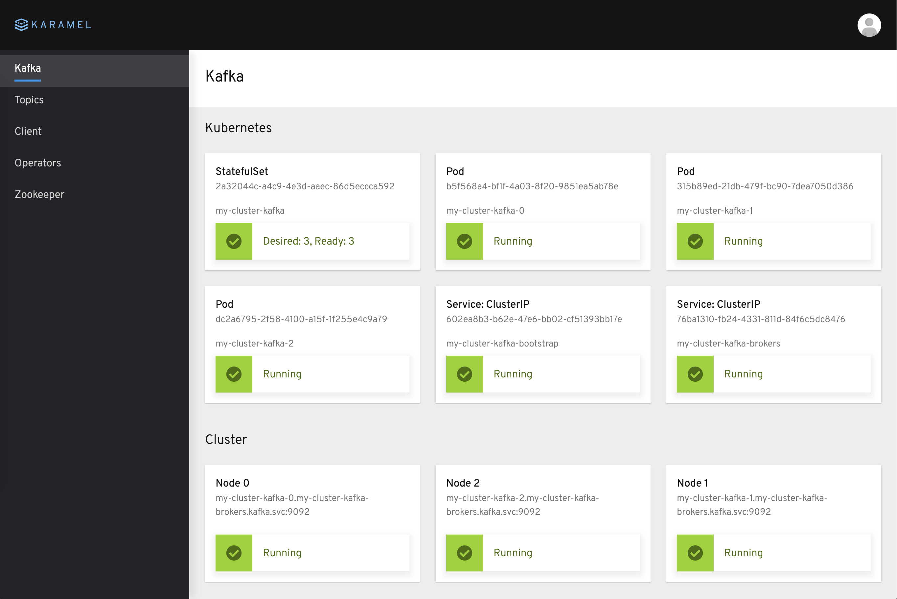
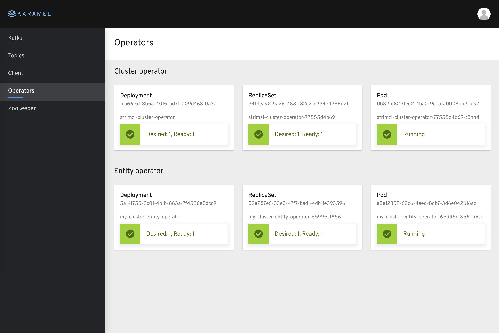
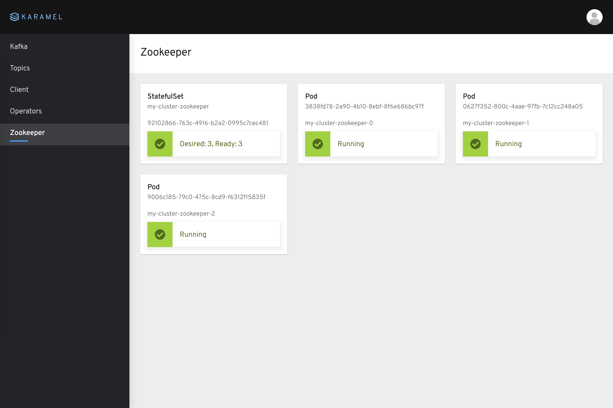
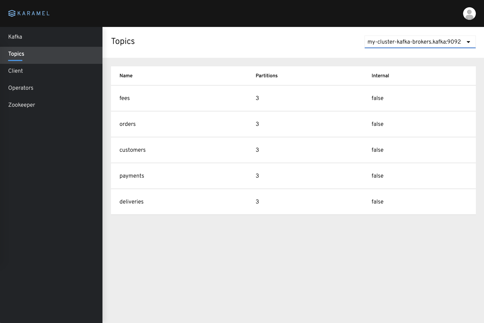
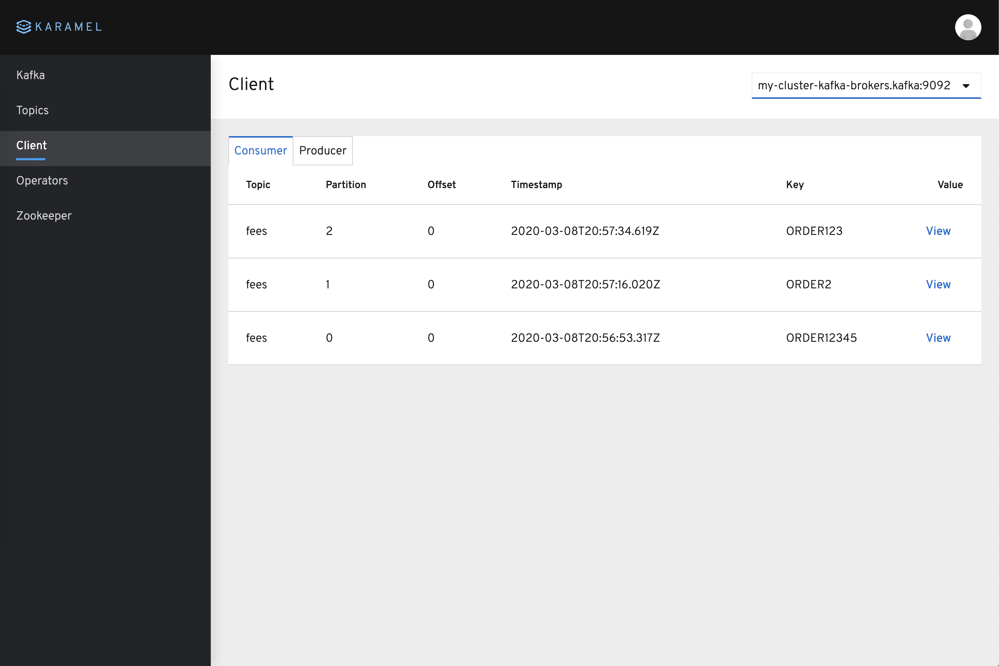
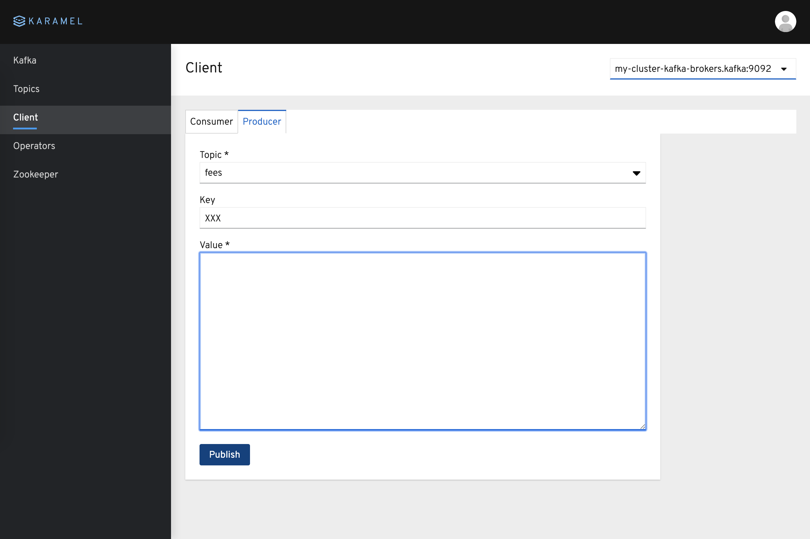

# Karamel


Simple Kafka Browser that supports standalone Kafka and Strimzi operator.

- Kafka cluster status
- Topic list
- Consumer (filter WIP)
- Producer 
- Strimzi Operator status (Kubernetes only)
- Zookepers status (Kubernetes only)
- Kafka resources status (Kubernetes only)

## Running in Minikube

#### Install strimzi 
Prequisites: Minikube, Ansible
```
ansible-playbook minikube/install.yaml 
```
#### Deploy karamel
Prequisites: Java 11
```
ansible-playbook minikube/deploy.yaml 
```

## Running in Docker compose

#### Build Karamel Docker 
Prequisites: Docker Desktop
Build jdk version
```
mvn package
docker build -t entropy1/karamel .
```
Build native application
```
docker build -f Dockerfile.native -t entropy1/karamel-native .
```
#### Run in Docker Compose with Kafka
Prequisites: Java 11
```
cd compose
docker-compose up -d
docker-compose exec kafka kafka-topics --create --bootstrap-server localhost:9092 -replication-factor 1 --partitions 1 --topic users
```

## Development
#### Running the application in dev mode
```
mvn quarkus:dev
```
#### Packaging and running the application
The application is packageable using 
```
mvn package
java -jar target/karamel-1.0.0-SNAPSHOT-runner.jar
```


### Screenshots
#### Kafka

#### Strimzi operator

#### Zookeeper

#### Topics

#### Client - consumer

#### Client - producer

