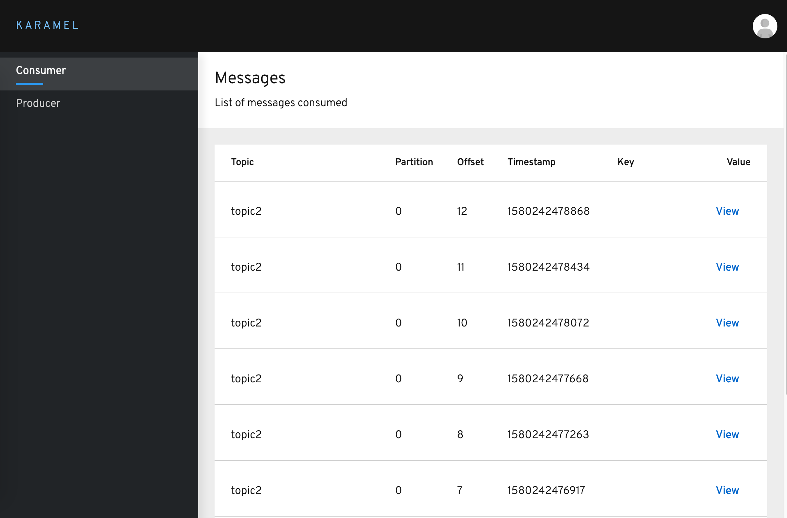
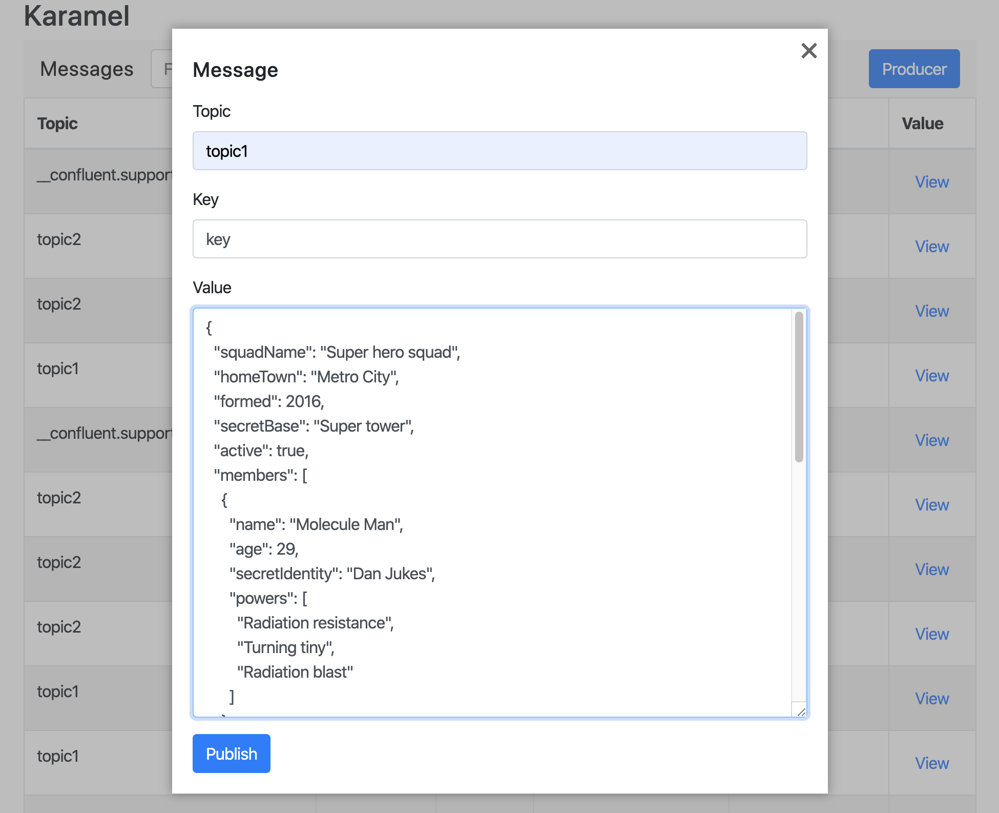

# Karamel

Simple Kafka Web-based Consumer and Producer.

- Consumer listens all topics
- Messages could be filtered by topic
- Producer could publish in any topic

## Running the application in dev mode

You can run your application in dev mode that enables live coding using:
```
./mvnw quarkus:dev
```

## Packaging and running the application

The application is packageable using 
```
./mvnw package
java -jar target/karamel-1.0.0-SNAPSHOT-runner.jar
```

## Creating a native executable

You can create a native executable using: 
```
docker build -f src/main/docker/Dockerfile.multistage -t karamel/karamel .
```

## Running the native executable via Docker Compose with Kafka

```
cd compose
docker-compose up
```

### Screenshots
#### Consumer


#### Producer

